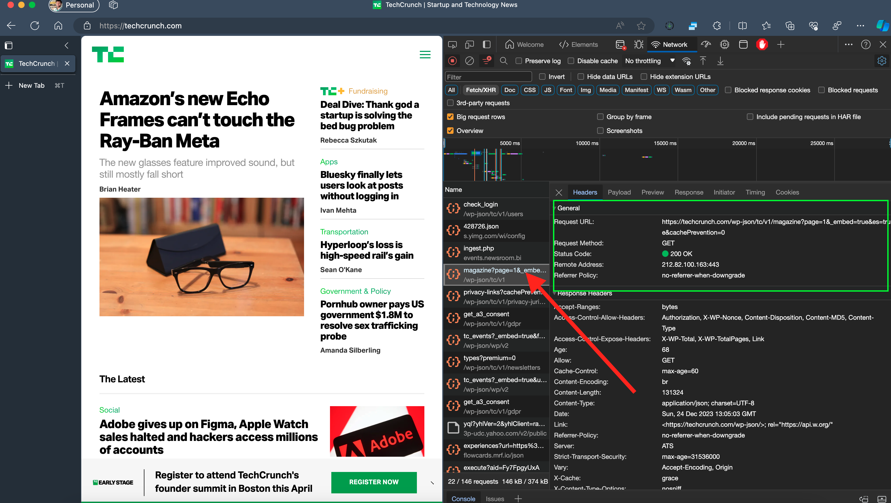
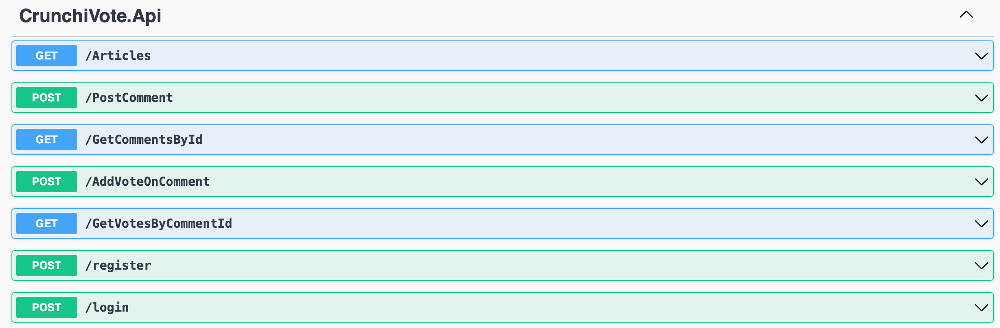

# CrunchiVote App (backend + frontend)

# Prerequisites

- ## .Net8
- ## Docker
- ## global dotnet efcore tool

### 99.5% pure .net framework used, no 3rd party library used for this project except polly for implementing resiliency

#### projects are implented to follow `Domain Driven Design` process, `CQRS  `architectural pattern,`SOLID Principles` `OPTION Pattern` `Result Pattern` development guideline

## How to run / setup this project on your local environment
# Latest update
1. clone this repository by following this command

   `git clone https://github.com/MamunIssacProton/CrunchiVote.git`
   using your terminal/command prompt

2. navigate to the project directory. you can use command like `cd CrunchiVote`

3. execute the startup.sh bash file with a bash terminal by following

`bash setup.sh`

### That's all you need to do the setup on this updated version

<!-- 
or use visual studio code docker plugin to do docker-compose-up operation

4. Open the Solution (sln file) in Visual Studio or your IDE

5. Select the `CrunchiVote.Infrastructure` project to do the

### Databse migrations

you can also navigate to the project by usng

`cd CrunchiVote/backend/src/CrunchiVote.Infrastructure`

from previous working directory

6. do migration by following this command

   `dotnet ef migrations add init`

   you can use your own migration name insted of init

7. apply pending migrations to database by following this command

   `dotent ef database update`

8. make sure you've performed database migrations on `CrunchiVote.Identity Project also`, to do the migration, use this command by navigating to `CrunchiVote/backend/src/CrunchiVote.Identity` project
   and running
   `dotent ef database update`
9. now select `CrunchiVote.Api` project to run the api project. you can use `dotnet run ` or `dotnet watch` by navigating `CrunchiVote/backend/src/CrunchiVote.Api` project.

10. For Front-end Application, nagivate to `CrunchiVote/frontend/crunchivote` directory and run `npm install` to perform `npm start` and this will run the front-end.
11. Make sure you are running the `backend` applicaion first and the `front end application to see the data on web app` else you can still use the `APIs`by running the `backend` project and navigating your localhost like
    `http://localhost:5254/swagger/index.html` to see all available endpoints.

### There is no Database seeding technique implemented on project, so in order to test all feature, please do consider by creating by using api endpoints.

# `where you can extract Tech Crunch api`

# Task Features on API

1. **Added Option Pattern for appsettings with validations** - _done_
2. **Added Application Resiliency on Api project** - _done_
3. **Added Centralized Global Error Handling** - _done_
4. **Added ResultPattern for better developer experience** - _done_
5. **Added Input validation** - _done_
6. **Added Domain Business Logic Validation** - _done_
7. **Added Automated Runtime Dependency Injection based on a Signature Interface** - _done_
8. **Added Auth and Authz** - _done_
9. **Added Response Compression** - _done_
10. **Added Rate Limiter** - _done_
11. **Added FaultTolarance** - _done_
12. **Well Structure Data with proper formatting based on requirement** - _done_

# Constraints used for logical validation

1. Page Number must be in between 1 to 500
2. Article Id must be minimum 6 digits and cannot start with Zero
3. A Comment Owner/Comment Poster can’t vote his/her own Comment.
4. Once a User voted one type of vote, such as UpVote, then the user is no more eligible to vote the same category. User should try with another available category.
5. Vote Type must not exceed the Available vote range. In this case, it cannot be greater than 1.

# Todo/Future improvements

1. **Add Architecture Test**
2. **Add Event Sourcing**
3. **Add Resiliency on Commenting**
4. **Add Serilog for logging**

# UnFinished features on Front-end Application [was running out of time]

1. **Implement global State Management with lazy load**
2. **user signup**
3. **giving upvote and downvote from application**

## Due to Visual Studio for mac does not support any workload for .NET 8, I've used Individual project configurations appsettings.json for independent database migration.such as `Infrastructre` and `Identity` project and due to same file as output file from multiple project, the given `Dockerfile` or `dotnet publish` will not working or unable to build the `docker image`.

### `used apis`

### `add beaer token after authentication`

### `articles data`

 -->
